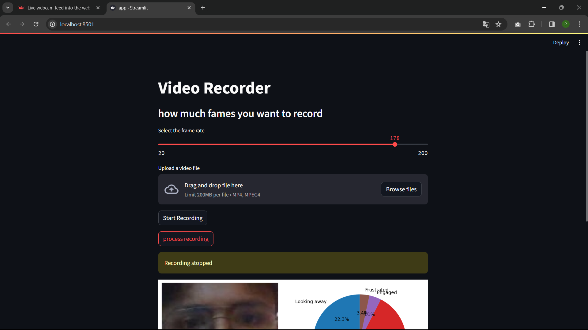
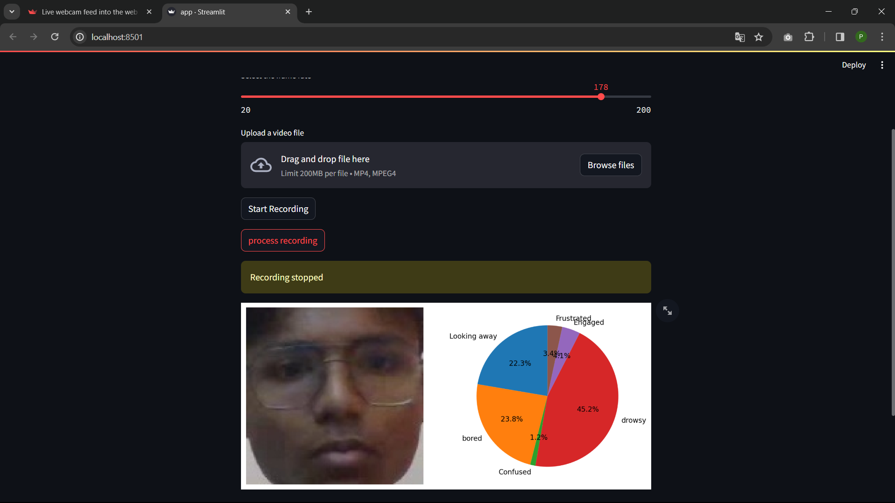

# Classroom Engagement Monitor

## Description

The "Classroom Engagement Monitor" challenge invites participants to leverage Computer Vision technology to develop an innovative system for tracking and analyzing student participation in the classroom. The primary objective is to create a robust solution that utilizes Computer Vision algorithms to monitor and assess student engagement levels during academic sessions. Participants are encouraged to design a prototype that intelligently captures and evaluates student interactions, expressions, and attentiveness in real-time. The anticipated solution should employ Computer Vision techniques to accurately measure and interpret student engagement, offering valuable insights for educators to enhance classroom dynamics. The ultimate goal is to develop an intelligent monitoring system that optimizes student participation and fosters a more interactive and engaging learning environment.

## Features

- **Video Recording:** Users can record videos using their webcam.
- **Frame Rate Selection:** Users can choose the frame rate for video recording.
- **Video Upload:** Users can also upload existing video files for analysis.
- **Student Engagement Analysis:** The application processes recorded/uploaded videos to analyze student engagement, detecting emotions like boredom, confusion, drowsiness, engagement, and frustration.
- **Visualizations:** Provides visualizations such as pie charts displaying student engagement metrics.

## Setup

1. to install dlib :
 pip install filepath for dlib. whl 
 - choose whl wiselt according to python version 
# Usage
## Recording Video:

- Click on the "Start Recording" button to begin recording using your webcam.
- Choose the desired frame rate for recording.
- Click the "Stop Recording" button to stop the recording process.
- The recorded video will be displayed along with analysis results.
## Uploading Video:

- Alternatively, you can upload an existing video file by clicking on the "Upload a video file" button.
- After uploading, click on the "Process Video" button to analyze the uploaded video.
- Analyzing Results:

- Once the video processing is complete, the application displays visualizations depicting student engagement metrics.
- Pie charts show the distribution of various emotions among students.
- For multiple students, individual engagement percentages are displayed along with an average.
## Examples

Contributing
Pull requests are welcome. For major changes, please open an issue first to discuss what you would like to change.
